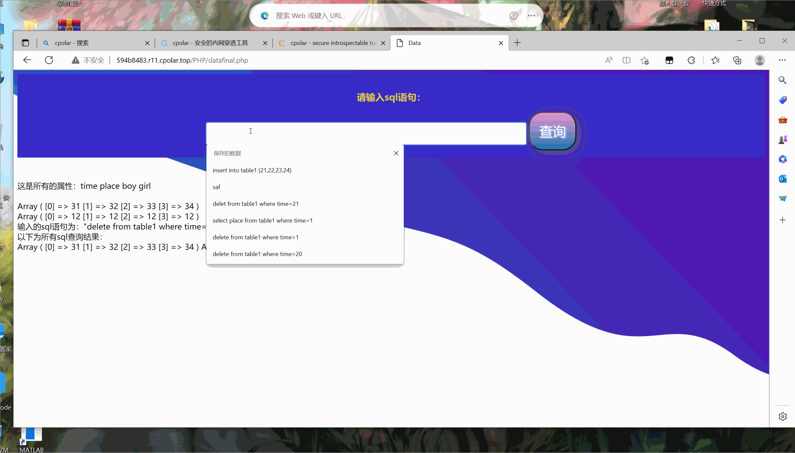

# database_sys
### cporal Xampp php 将html本地网站与数据库连接并作内网穿透
This is the project for database system course  
follow my steps and you will get the project  
firstly you need to dowload some tools:  
* Xampp
* Cpolar
* vscode 

secondly you need to set you Xampp following this blog:  
[博客网页](https://blog.csdn.net/baidu_25343343/article/details/53004815)  
[bilibili 视频](https://www.bilibili.com/video/BV1hR4y1L7DT/?spm_id_from=333.337.search-card.all.click&vd_source=37cd9642f9dd0e2c4477db8a5e738a8a)

Note that this is based on php for connection with mysql, you need to install xdebug for debugging the php script 

Thirdly, what you need to do is write a simple html and php file to achieve the basical function that the web need to provide  
[简单的登录界面和页面跳转](https://blog.csdn.net/qq_51861704/article/details/124702822)   
[简单的php连接数据库](https://blog.csdn.net/qq_41027228/article/details/103979315)

Note that the version of php of 7 is quite different from the old version of 5, where most of the function being called should be replaced by `mysqli` instead of `mysql` 

Then, we need Cpolar in order to NAT, which is used to put you web onto the WAN, so other people can get your web service via www  
following this [内网穿透](https://blog.csdn.net/qq_19309473/article/details/127400122)

  
这里修改了部分php代码，以解决上面出现的问题  

  

---
**后续内容即数据库搭建和完善在"数据库大作业.doxc"中均有提及，在此不再赘述。**
